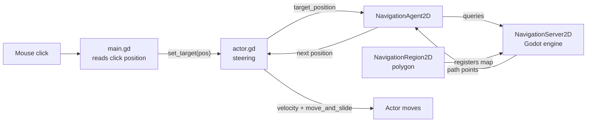
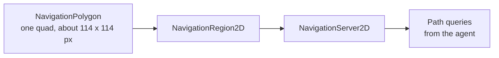
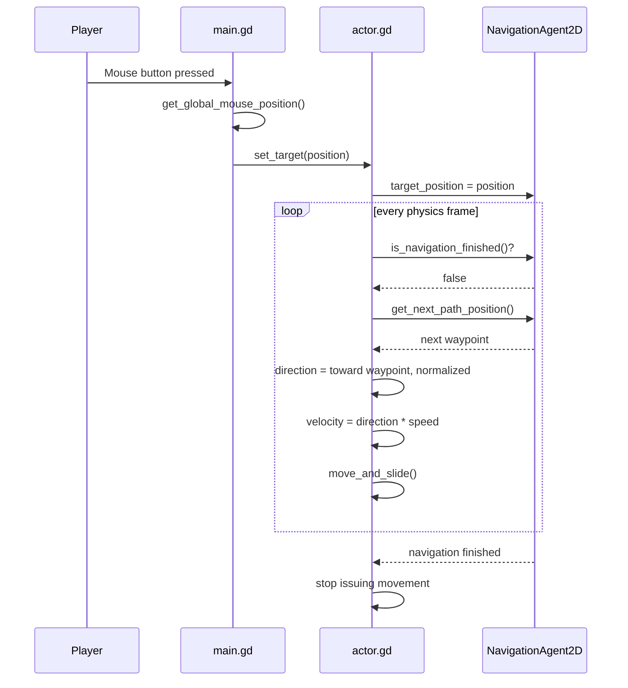
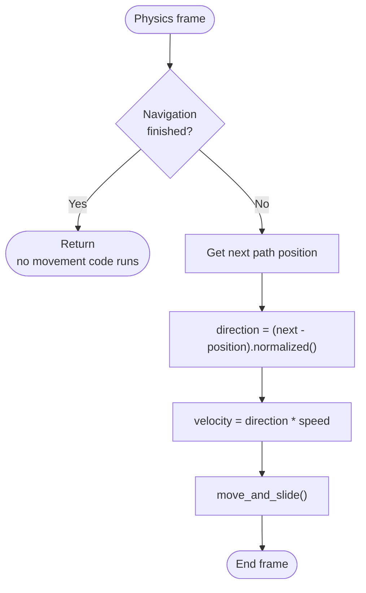
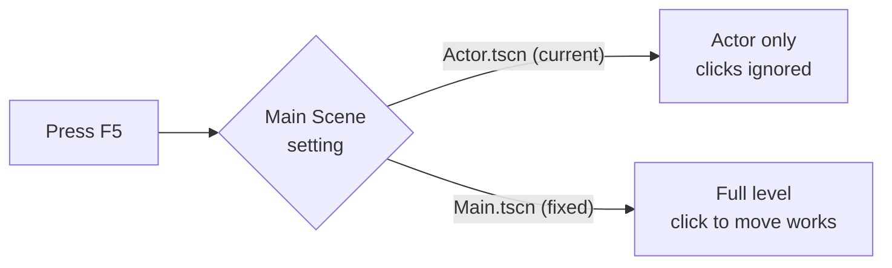
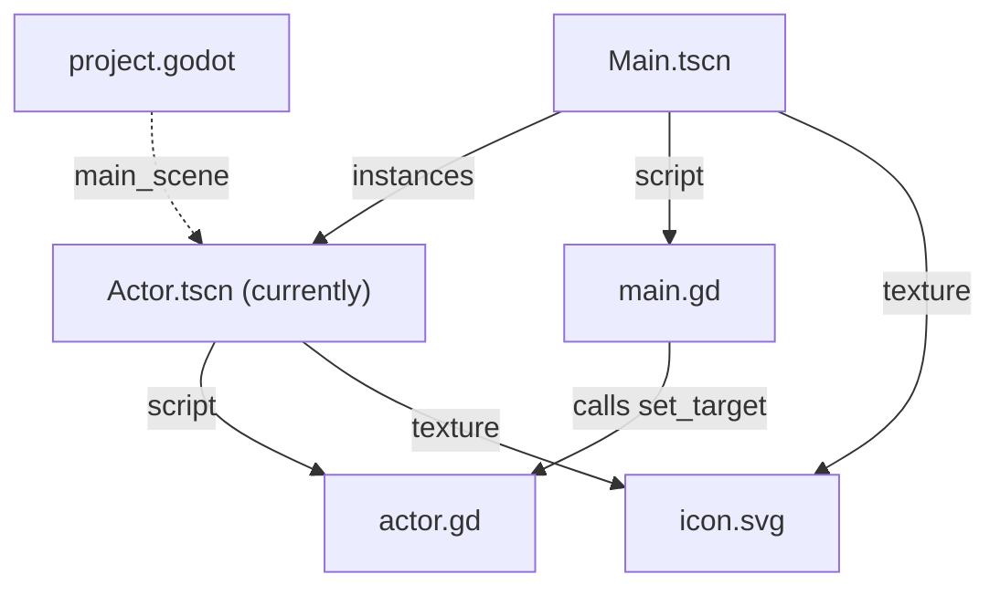
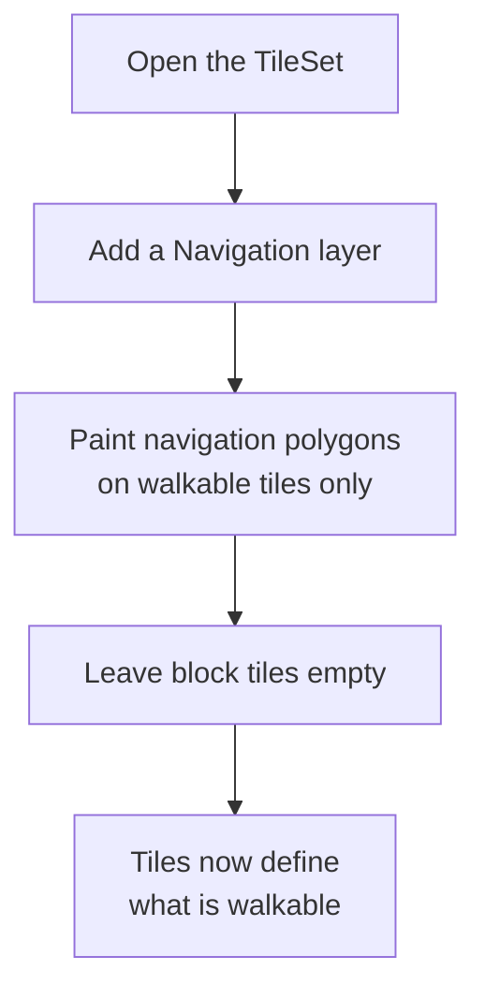
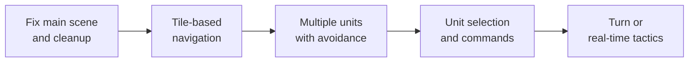

# ApexTactics | 2D Tactical Pathfinding

A small **Godot 4** project demonstrating point-and-click movement driven by Godot's navigation system. Click anywhere on the map and the actor computes a path across a navigation mesh and walks to the target.


---

## Table of Contents

1. [Overview](#1-overview)
2. [Architecture](#2-architecture)
3. [How It Works](#3-how-it-works)
4. [Requirements](#4-requirements)
5. [Quick Start](#5-quick-start)
6. [Controls](#6-controls)
7. [Project Structure](#7-project-structure)
8. [Code Walkthrough](#8-code-walkthrough)
9. [Configuration Reference](#9-configuration-reference)
10. [Known Issues](#10-known-issues)
11. [Extending the Project](#11-extending-the-project)
12. [Roadmap](#12-roadmap)
13. [License](#13-license)

---

## 1. Overview

ApexTactics is the foundation for a tactics-style game. It focuses on three building blocks:

| Goal | Implementation | Status |
|---|---|---|
| Intelligent pathfinding | `NavigationAgent2D` on the actor, `NavigationRegion2D` with a `NavigationPolygon` in the level | Working |
| Point-and-click movement | Mouse click in `main.gd`, vector-math steering in `actor.gd` | Working |
| Grid-based environment | `TileMapLayer` holding a 17 x 14 tile grid | Visual only (see [Known Issues](#10-known-issues)) |

The whole project is two scripts and two scenes, which makes it easy to read end to end and to build on.

---

## 2. Architecture

### 2.1 Scene tree

`Main.tscn` is the level. It instances `Actor.tscn` as a child.


### 2.2 Who talks to whom



### 2.3 Navigation data

The walkable area comes from a single `NavigationPolygon` resource on the region node. The tiles do not currently contribute to it.



---

## 3. How It Works

### 3.1 From click to movement



### 3.2 The per-frame decision

This is the entire logic of `_physics_process` in `actor.gd`:



### 3.3 Vector math

Steering is a single normalize-and-scale step:

```text
direction = (next_path_position - global_position).normalized()
velocity  = direction * speed          # speed = 300 px/s
```

`normalized()` gives a unit vector pointing at the next waypoint, and multiplying by `speed` makes the actor move at a constant 300 pixels per second regardless of distance. `move_and_slide()` applies the velocity and handles collisions.

### 3.4 The level layout

The `TileMapLayer` contains 238 tiles on a 17 x 14 grid (columns -1 to 15, rows -5 to 8). Two tile variants are used: 215 of one and 23 of another. The second variant forms a block in the upper left (`#` below, `.` is the first variant):

```text
   x: -1 0 1 2 3 4 5 6 ... 15
y=-5   . . . . . . . . ...  .
y=-4   . . . . . . . . ...  .
y=-3   . . . . . . . . ...  .
y=-2   . . . . . . . . ...  .
y=-1   . . # # # # # . ...  .
y= 0   . . # # # # # . ...  .
y= 1   . . # # # # # . ...  .
y= 2   . . . # # # # . ...  .
y= 3   . . . # # # # . ...  .
y= 4   . . . . . . . . ...  .
...
y= 8   . . . . . . . . ...  .
```

The navigation polygon covers roughly x 49 to 166 and y -42 to 72 in world pixels, a much smaller area than the tile grid.

---

## 4. Requirements

- **Godot 4.6** (the project file lists the `4.6` feature tag, and the scene files use the newer `unique_id` format)
- A GPU supported by the **Forward+** renderer
- Windows uses the **Direct3D 12** driver (set in `project.godot`); other platforms use Godot's defaults

No plugins, add-ons, or external dependencies.

---

## 5. Quick Start

### 5.1 Open and run

1. Install Godot 4.6 from [godotengine.org](https://godotengine.org/download).
2. Clone the repository:

   ```bash
   git clone <your-repo-url>
   cd apex-tactics
   ```

3. In the Godot Project Manager, click **Import**, then select `project.godot`.
4. Open `scenes/Main.tscn`.
5. Press **F6** (Run Current Scene).

### 5.2 Important: pressing F5 runs the wrong scene

`project.godot` currently sets the main scene to `uid://cdyvdhf6bcl3u`, which is the UID of **`Actor.tscn`**, not `Main.tscn`. Pressing **F5** therefore launches only the actor with no level and no click handling, so clicking does nothing.

To fix it, go to **Project > Project Settings > Application > Run > Main Scene** and select `res://scenes/Main.tscn`. In `project.godot` the line becomes:

```ini
run/main_scene="uid://xadoct2alt5c"
```



---

## 6. Controls

| Input | Action |
|---|---|
| Any mouse button (press) | Set the actor's destination to the cursor position |

Any mouse button works because the check is `InputEventMouseButton` with `pressed`, with no button filter.

---

## 7. Project Structure

```text
apex-tactics/
├── project.godot          # Engine config (Godot 4.6, Forward+, D3D12 on Windows)
├── README.md
├── .editorconfig          # UTF-8
├── .gitattributes         # LF line endings
├── .gitignore             # .godot/, export presets, OS files
├── assets/
│   ├── icon.svg           # Project icon, also used as actor sprite and tile atlas
│   └── icon.svg.import
├── scenes/
│   ├── Main.tscn          # Level: navigation region, tile map, actor instance
│   └── Actor.tscn         # Movable unit: body, sprite, collision, nav agent
└── src/
    ├── main.gd            # Click handling
    └── actor.gd           # Path-following movement
```

### File relationships



---

## 8. Code Walkthrough

### `src/main.gd`

```gdscript
extends Node2D

@onready var player = $Actor

func _unhandled_input(event):
    if event is InputEventMouseButton and event.pressed:
        print("Click detected at: ", get_global_mouse_position())
        player.set_target(get_global_mouse_position())
```

- `$Actor` must match the instanced node's name in `Main.tscn`.
- `_unhandled_input` only fires for input that no UI control consumed, which is the right place for world clicks.
- `get_global_mouse_position()` converts the screen click into world coordinates.

### `src/actor.gd`

```gdscript
extends CharacterBody2D

var speed = 300.0
@onready var nav_agent = $NavigationAgent2D

func _physics_process(_delta):
    if nav_agent.is_navigation_finished():
        return

    print("Moving toward: ", nav_agent.get_next_path_position())

    var next_path_pos = nav_agent.get_next_path_position()
    var direction = (next_path_pos - global_position).normalized()

    velocity = direction * speed
    move_and_slide()

func set_target(target_pos):
    nav_agent.target_position = target_pos
```

- `set_target` is the actor's public API. Setting `target_position` triggers a new path query.
- The actor uses `motion_mode = 1` (**Floating**) on its `CharacterBody2D`, the right mode for top-down movement with no gravity or floor.

### Actor scene details

| Node | Notes |
|---|---|
| `CharacterBody2D` (root) | Floating motion mode, script `actor.gd` |
| `Sprite2D` | `icon.svg`, offset 7 px down |
| `NavigationAgent2D` | All properties at engine defaults |
| `CollisionShape2D` | Circle, radius about 10.3 px, offset toward the sprite's lower half |

---

## 9. Configuration Reference

| Setting | Value | Where |
|---|---|---|
| Movement speed | `300.0` px/s | `actor.gd` (`speed`) |
| Motion mode | Floating | `Actor.tscn` |
| Collision shape | Circle, r about 10.3 | `Actor.tscn` |
| Navigation mesh | 1 polygon, 4 vertices | `Main.tscn` (`NavigationPolygon`) |
| Tile grid | 17 x 14, 238 tiles | `Main.tscn` (`TileMapLayer`) |
| Tile atlas | `icon.svg` cut into an 8 x 8 grid of cells | `Main.tscn` (`TileSet`) |
| Renderer | Forward+ | `project.godot` |
| Windows graphics driver | Direct3D 12 | `project.godot` |
| 3D physics engine | Jolt | `project.godot` (unused by this 2D project) |

Nothing on the `NavigationAgent2D` is overridden, so its behavior is governed by Godot's defaults (for example, `avoidance_enabled` is off).

---

## 10. Known Issues

Worth knowing before building on the project:

- **Wrong main scene.** F5 launches `Actor.tscn`, not `Main.tscn`. See [section 5.2](#52-important-pressing-f5-runs-the-wrong-scene).
- **Engine version mismatch in older docs.** The previous README said Godot 4.3, but the project targets 4.6 and its scene format may not open in older versions.
- **Tiles do not affect navigation.** The `TileSet` has no navigation or physics layers, so the 23 block tiles are decoration. Pathing is determined only by the single `NavigationPolygon`, which does not line up with the tile block.
- **The walkable area is small.** The polygon covers about 114 x 114 px while the tile grid is roughly 272 x 224 px. A click outside the polygon typically sends the actor to the nearest reachable point on the mesh.
- **No dynamic obstacle avoidance.** Avoidance (agents steering around each other) is off. The current behavior is pathfinding around static geometry only, which matters if you add more than one actor.
- **Debug printing every frame.** `actor.gd` prints on every physics frame while moving, which floods the output panel and slows things down.
- **Path position queried twice per frame.** `get_next_path_position()` is called twice in `_physics_process`. Godot's documentation says to call it once per physics frame, so the debug print should be removed or should reuse the stored value.
- **Any mouse button triggers movement,** including the right and middle buttons and the wheel.
- **No "high-performance" evidence.** The old README described the system as high-performance, but no benchmarks or profiling are included.
- **No LICENSE file** is present in the repository.

---

## 11. Extending the Project

### 11.1 Clean up the actor loop

```gdscript
func _physics_process(_delta):
    if nav_agent.is_navigation_finished():
        velocity = Vector2.ZERO
        return

    var next_pos = nav_agent.get_next_path_position()
    velocity = global_position.direction_to(next_pos) * speed
    move_and_slide()
```

This calls the path query once, removes the print, and zeroes velocity when finished.

### 11.2 Left-click only

```gdscript
func _unhandled_input(event):
    if event is InputEventMouseButton and event.pressed \
            and event.button_index == MOUSE_BUTTON_LEFT:
        player.set_target(get_global_mouse_position())
```

### 11.3 Make tiles real obstacles



Once the walkable tiles carry navigation polygons, the `TileMapLayer` registers them with the navigation server and the hand-drawn `NavigationPolygon` can be removed. Tiles left without one become obstacles the path routes around.

### 11.4 Multiple actors with avoidance

```gdscript
func _ready():
    nav_agent.avoidance_enabled = true
    nav_agent.velocity_computed.connect(_on_velocity_computed)

func _physics_process(_delta):
    if nav_agent.is_navigation_finished():
        return
    var next_pos = nav_agent.get_next_path_position()
    nav_agent.velocity = global_position.direction_to(next_pos) * speed

func _on_velocity_computed(safe_velocity: Vector2):
    velocity = safe_velocity
    move_and_slide()
```

With avoidance on, the agent proposes a velocity and Godot returns an adjusted one that steers around other agents.

---

## 12. Roadmap

Suggested next steps toward a tactics game:



- [ ] Set `Main.tscn` as the main scene
- [ ] Remove debug prints and the duplicate path query
- [ ] Add navigation layers to the `TileSet`
- [ ] Enable and tune agent avoidance
- [ ] Add a path or destination marker
- [ ] Add selection of multiple units

---

## 13. License

No license file is included yet. Add one (for example MIT) before publishing.

The Godot icon used as the sprite and tile atlas is part of Godot's default project template; check Godot's branding terms if you distribute the project.
