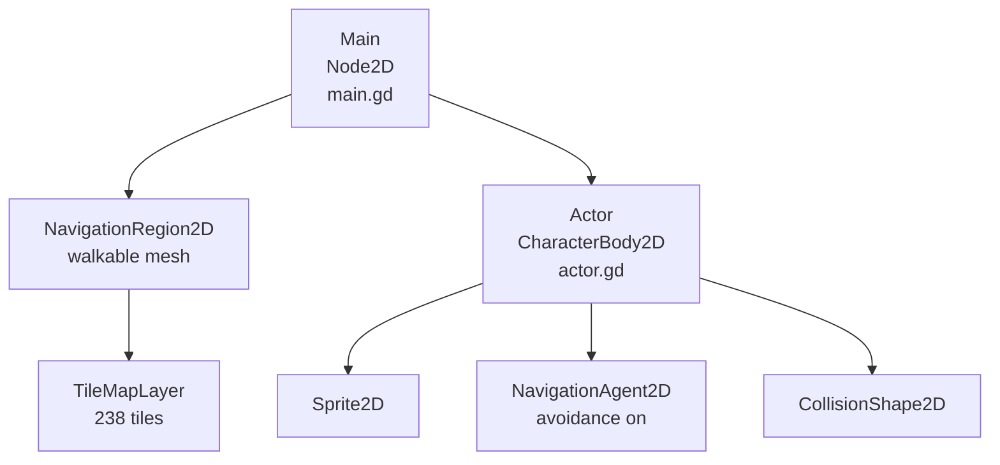
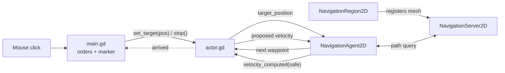
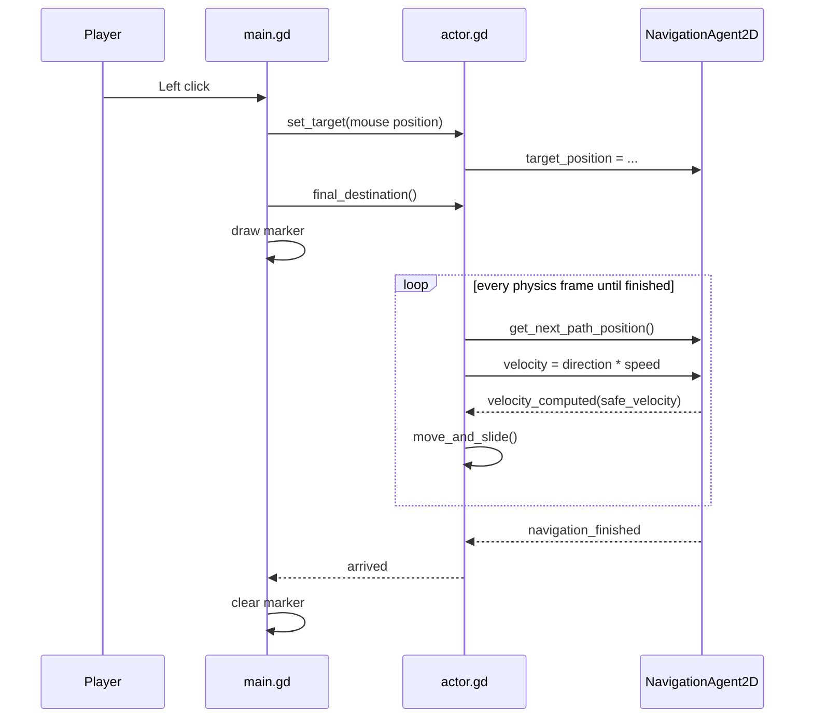

# ApexTactics | 2D Tactical Pathfinding

The movement foundation for a tactics game in Godot 4: click anywhere on the map and the unit finds a route **around obstacles** using Godot's navigation server, steering with local avoidance so several units can share the map.


---

## Table of Contents

1. [Overview](#1-overview)
2. [Architecture](#2-architecture)
3. [How It Works](#3-how-it-works)
4. [Requirements](#4-requirements)
5. [Quick Start](#5-quick-start)
6. [Controls](#6-controls)
7. [Project Structure](#7-project-structure)
8. [Code Walkthrough](#8-code-walkthrough)
9. [Configuration Reference](#9-configuration-reference)
10. [Extending the Project](#10-extending-the-project)
11. [Roadmap](#11-roadmap)
12. [License](#12-license)

---

## 1. Overview

| Building block | Implementation |
|---|---|
| Pathfinding around obstacles | `NavigationRegion2D` whose mesh covers the whole tile grid, with a hole where the stone block sits |
| Point-and-click orders | Left-click to move, right-click to stop, with a marker at the reachable destination |
| Local avoidance | `NavigationAgent2D.avoidance_enabled` with the `velocity_computed` callback, ready for multiple units |
| Grid-based level | `TileMapLayer`: 238 tiles on a 17 × 14 grid |

---

## 2. Architecture

### 2.1 Scene tree



### 2.2 Who talks to whom



### 2.3 Navigation mesh

The mesh is a rectangle covering the full tile grid (x −16…256, y −80…144 in region space) with a hole over the stone block's bounding box (x 16…96, y −16…64). It's split into four convex polygons around the hole:

```text
+-------------------------------+
|             top               |
|      +-------------+          |
| left |   (block)   |  right   |
|      +-------------+          |
|            bottom             |
+-------------------------------+
```

Because the hole isn't walkable, a click on the far side of the block makes the actor walk around it, and a click *inside* the block sends the actor to the nearest edge (shown by the marker).

---

## 3. How It Works

### 3.1 From click to movement



### 3.2 Steering

```text
proposed  = global_position.direction_to(next_waypoint) * speed     # 300 px/s
velocity  = safe_velocity from the avoidance system
```

The path is queried **once per physics frame**, as Godot recommends. With avoidance on, the agent proposes a velocity and the navigation server returns one adjusted to avoid other agents. With a single actor the two are the same.

### 3.3 Level layout

238 tiles on a 17 × 14 grid (columns −1…15, rows −5…8). 23 stone tiles form the block in the upper left (`#`):

```text
   x: -1 0 1 2 3 4 5 6 ... 15
y=-1   . . # # # # # . ...  .
y= 0   . . # # # # # . ...  .
y= 1   . . # # # # # . ...  .
y= 2   . . . # # # # . ...  .
y= 3   . . . # # # # . ...  .
```

---

## 4. Requirements

- **Godot 4.6** (scenes use the 4.6 `unique_id` format)
- A GPU supported by the Forward+ renderer
- No plugins or add-ons

---

## 5. Quick Start

1. Install Godot 4.6 from [godotengine.org](https://godotengine.org/download).
2. Clone the repository:

   ```bash
   git clone https://github.com/JoshuaOmosa/apex-tactics.git
   ```

3. In the Godot Project Manager, click **Import** and select `project.godot`.
4. Press **F5**. The main scene is `scenes/Main.tscn`.
5. Left-click on the far side of the stone block and watch the unit route around it.

To see the mesh while playing, enable **Debug > Visible Navigation** in the editor.

---

## 6. Controls

| Input | Action |
|---|---|
| Left click | Move to the cursor (or the nearest reachable point) |
| Right click | Stop where you are |

---

## 7. Project Structure

```text
apex-tactics/
├── project.godot          # Main scene: scenes/Main.tscn
├── LICENSE
├── README.md
├── assets/icon.svg        # Sprite and tile atlas
├── scenes/
│   ├── Main.tscn          # Level: navigation mesh, tile map, actor
│   └── Actor.tscn         # Unit: body, sprite, collision, nav agent
└── src/
    ├── main.gd            # Orders and destination marker
    └── actor.gd           # Path following with avoidance
```

---

## 8. Code Walkthrough

### `src/actor.gd`

```gdscript
signal arrived

@export var speed: float = 300.0

func _ready() -> void:
	nav_agent.avoidance_enabled = true
	nav_agent.max_speed = speed
	nav_agent.velocity_computed.connect(_on_velocity_computed)
	nav_agent.navigation_finished.connect(func(): arrived.emit())

func _physics_process(_delta: float) -> void:
	if nav_agent.is_navigation_finished():
		velocity = Vector2.ZERO
		return
	var next_pos := nav_agent.get_next_path_position()
	nav_agent.velocity = global_position.direction_to(next_pos) * speed

func _on_velocity_computed(safe_velocity: Vector2) -> void:
	velocity = safe_velocity
	move_and_slide()
```

The actor's public API is `set_target()`, `stop()`, `final_destination()`, and the `arrived` signal. Its parent never touches the navigation agent directly. `speed` is `@export`ed, so it can be tuned per unit in the inspector.

### `src/main.gd`

Handles left/right clicks in `_unhandled_input` (so UI added later can consume clicks first). After an order it asks the actor for its `final_destination()` and draws a marker in `_draw()`. The marker is cleared when `arrived` fires or the order is cancelled.

---

## 9. Configuration Reference

| Setting | Value | Where |
|---|---|---|
| Movement speed | 300 px/s (`@export`) | `actor.gd` |
| Avoidance | On | `actor.gd` `_ready()` |
| Motion mode | Floating (top-down, no gravity) | `Actor.tscn` |
| Navigation mesh | 4 convex polygons around one hole | `Main.tscn` |
| Tile grid | 17 × 14, 16 px tiles | `Main.tscn` |

---

## 10. Extending the Project

**More units.** Instance `Actor.tscn` a few more times. Avoidance is already on, so they'll steer around each other. Add a selection rectangle in `main.gd` to give orders to a group.

**Tiles as the source of truth.** Instead of the hand-built mesh, add a navigation layer to the `TileSet` and paint polygons on walkable tiles only. The `TileMapLayer` then registers them with the navigation server, and painting a new stone tile automatically becomes an obstacle.

**Grid-snapped movement for turn-based play.** Snap the target to the tile centre with `TileMapLayer.local_to_map()` / `map_to_local()` and cap the path length to a unit's movement points.

---

## 11. Roadmap

- [x] Path around static obstacles
- [x] Destination marker, left-click move, right-click stop
- [x] Local avoidance ready for multiple units
- [ ] Multiple units with box selection
- [ ] Tile-painted navigation layer
- [ ] Grid-snapped, turn-based movement with movement points

---

## 12. License

MIT. See [LICENSE](LICENSE). The sprite and tile atlas use Godot's default `icon.svg`.
